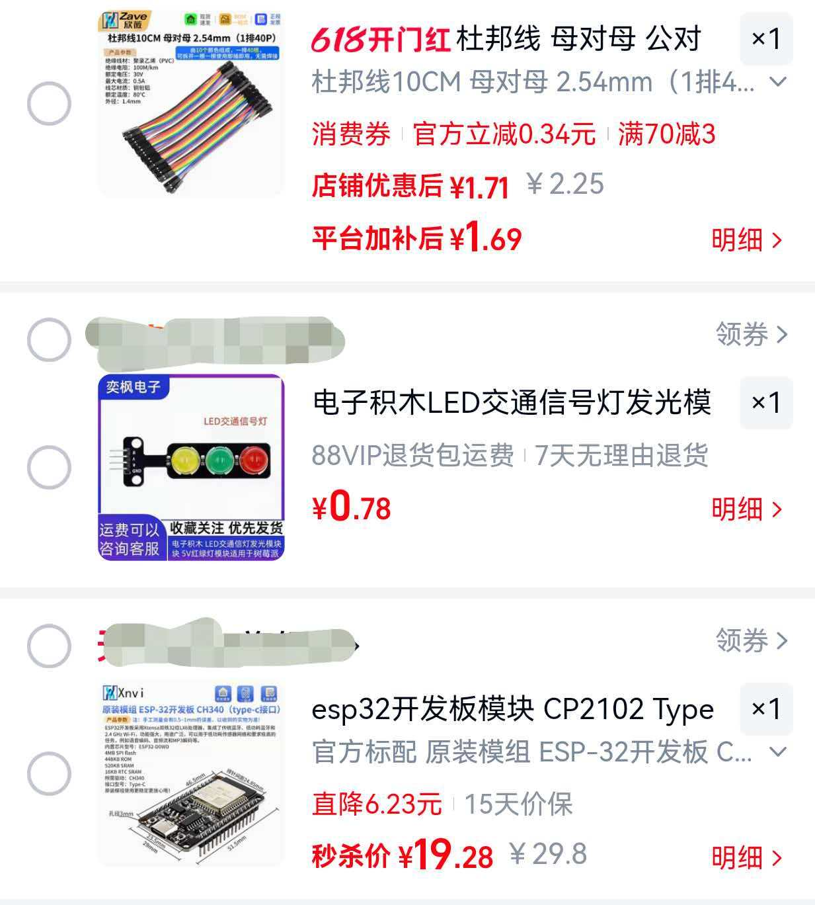

# Agent Light

将 ESP32 三色 LED 模块变成 Claude Code / Codex 的实时状态指示灯。

| 状态 | 灯光 |
|------|------|
| 空闲 | 绿灯常亮 |
| 思考中 | 黄灯闪烁 |
| 执行工具 | 红灯闪烁 |

## 前置条件

- Node.js（无需安装依赖）
- 通过 USB 串口连接的 ESP32 开发板
- 启动桥接前请关闭 Arduino IDE 的串口监视器

### 硬件

本项目使用 **ESP32 开发板** + **两个三色 LED 模块**。当前固件接线如下：

| 模块 | 绿灯 | 黄灯 | 红灯 | 用途 |
|------|------|------|------|------|
| Claude 状态灯 | GPIO25 | GPIO26 | GPIO27 | Claude/通用状态灯 |
| Codex 状态灯 | GPIO19 | GPIO18 | GPIO17 | Codex 专用状态灯 |

完整针脚定义见 [`docs/esp32-devkit-pinout.md`](docs/esp32-devkit-pinout.md)。

### Wi-Fi 配置

固件会同时保留 USB 串口、蓝牙串口和 Wi-Fi TCP 命令通道。Wi-Fi 配置优先读取 ESP32 内部存储，推荐先通过蓝牙串口或 USB 串口用设备管理 CLI 写入。

如果希望编译时内置默认 Wi-Fi，也可以创建 `firmware/agent-light/secrets.h`。该文件已被 `.gitignore` 忽略，不要提交到仓库；不创建该文件也可以正常编译。

```cpp
#pragma once

#define WIFI_SSID "your-2.4ghz-wifi-ssid"
#define WIFI_PASSWORD "your-wifi-password"
```

可参考 [`firmware/agent-light/secrets.example.h`](firmware/agent-light/secrets.example.h)。网络连接成功后会监听：

```text
agent-light.local:8766
```

如果 Windows 的 mDNS 解析不稳定，也可以在路由器后台查看 ESP32 的 IP 后直接连接，例如 `10.16.0.39:8766`。

### 蓝牙串口

固件同时启用了 Bluetooth Classic SPP。Windows 配对后会生成一个蓝牙虚拟 COM 口，可作为 USB 串口的替代通道。

蓝牙设备名：

```text
AgentLight
```

配对后在 Windows 的蓝牙高级设置里查看传入/传出 COM 口，例如 `COM8`。然后可以手动测试：

```powershell
npm run bridge -- --serial COM8
npm run light -- codex:thinking
```

如果测试正常，再用管理员 PowerShell 重新安装服务并指定蓝牙 COM 口：

```powershell
npm run service:install -- -Serial COM8
```

启用 Wi-Fi + 蓝牙后固件超过默认分区大小，需要使用 `Huge APP` 分区编译和上传：

```powershell
npm run firmware:compile
npm run firmware:upload
```



## 快速开始

### 1. 启动桥接服务

```sh
npm run bridge
```

桥接服务会自动检测串口。手动指定串口：

```sh
npm run bridge -- --serial COM3
npm run bridge -- --serial /dev/cu.usbmodem832101
```

### 2. 配置 Hooks

Codex 推荐在每台电脑上生成一次本机路径的 hooks：

```powershell
npm run codex:hooks:install
```

脚本会写入 `~/.codex/hooks.json`，并把命令指向当前仓库里的 `hook-client.mjs`。首次启用后在 Codex 中用 `/hooks` 审查并信任 hooks。

也可以手动参考 [`codex-hooks-snippet.json`](codex-hooks-snippet.json)，合并到 `~/.codex/hooks.json` 或项目 `.codex/hooks.json` 中；手动合并时必须把 `C:\path\to\agent-light` 改为本机实际路径。

如果在其它电脑上 Codex 已提示信任 hooks，但状态灯没有响应，先检查 `~/.codex/hooks.json` 里是否仍保留旧电脑的绝对路径，例如 `D:\Users\Project\esp32\agent-light\hook-client.mjs`。信任 hooks 只代表 Codex 允许执行命令，不会自动修正路径、安装 Node.js 或启动 `AgentLightBridge` 服务。

进一步诊断可运行：

```powershell
powershell -NoProfile -ExecutionPolicy Bypass -File .\scripts\diagnose-codex-hooks.ps1
```

诊断脚本会检查 hooks JSON 结构、Node.js、`hook-client.mjs` 路径、本机桥接服务监听状态，并显示最近的 `service\logs\hook-client.log` 和桥接日志。Codex 触发 hooks 后也会在 `service\logs\hook-client.log` 留下记录；如果这个日志没有新增，说明 Codex 没有实际执行 hook。

Claude Code 可继续使用 [`claude-settings-snippet.json`](claude-settings-snippet.json)，合并到 `~/.claude/settings.json` 中，并将代码片段中的路径修改为本仓库的实际位置。

Hook 事件对应关系：

- **UserPromptSubmit** — 黄灯闪烁（思考中）
- **PreToolUse** — 红灯闪烁（执行中）
- **PostToolUse** — 黄灯闪烁（回到思考）
- **Stop** — 绿灯常亮（空闲）

### 3. 手动测试

Claude 状态灯：

```sh
npm run light -- claude:idle
npm run light -- claude:thinking
npm run light -- claude:running
npm run light -- claude:Y:blink:700
npm run light -- claude:R:on
```

Codex 状态灯：

```sh
npm run light -- codex:idle
npm run light -- codex:thinking
npm run light -- codex:running
npm run light -- codex:R:on
```

## Windows 服务开机启动

可以把桥接程序注册为 Windows 服务，开机自动启动。服务会监听本机 `127.0.0.1:8765`，并通过配置的串口、蓝牙虚拟串口或 Wi-Fi TCP 写入 ESP32。

本仓库提供了一个轻量 C# 服务程序，使用 Windows 自带 .NET Framework 编译器构建，不需要下载第三方工具。不要直接用 `sc.exe create ... node serial-bridge.mjs`，普通 Node 进程不是 Windows 服务进程，会被系统判定启动失败。

构建服务程序：

```powershell
npm run service:build
```

安装并启动服务需要管理员 PowerShell：

```powershell
cd D:\Users\Project\esp32\agent-light
npm run service:install -- -Serial COM3
```

服务名为 `AgentLightBridge`，默认监听 `127.0.0.1:8765`，通讯后端由安装参数决定。安装脚本会生成 `service/agent-light-service.ini`。后续如需修改串口、TCP 地址或波特率，可以改这个文件后重启服务。

查看状态和日志：

```powershell
npm run service:status
```

卸载服务需要管理员 PowerShell：

```powershell
npm run service:uninstall
```

服务启动后，日常测试命令不变：

```powershell
npm run light -- codex:thinking
npm run light -- claude:thinking
```

## 设备管理 GUI

CLI 已经调通后，日常管理可以使用轻量 GUI，避免记忆大量命令。GUI 会复用本机 `AgentLightBridge` 服务，不直接占用 ESP32 串口。

构建设备管理器：

```powershell
npm run manager:build
```

启动设备管理器：

```powershell
npm run manager
```

设备管理器启动时会自动申请管理员权限，用于安装/卸载服务、重启服务和切换通讯方式。

如果当前 PowerShell 禁止执行 `npm.ps1`，使用：

```powershell
npm.cmd run manager
```

GUI 当前提供这些功能：

- 查看 Windows 服务、本机桥接和 ESP32 状态。
- 安装/修复或卸载 Windows 服务；卸载前会二次确认。
- 切换服务通讯方式：USB/蓝牙串口或 Wi-Fi TCP。
- 写入 ESP32 Wi-Fi 配置；读取 Wi-Fi 状态会回填 SSID，密码只会从本机已加密保存的“记住密码”记录中恢复。
- 测试 Claude 状态灯和 Codex 状态灯。
- 发送 `sys:info`、`sys:ping`、`wifi:status` 等管理命令。
- 查看最近服务日志。

## 设备管理 CLI

CLI 仍保留为调试和高级入口，可用于查看 ESP32 状态、扫描连接方式、切换 Windows 服务使用的通讯后端，以及通过已连接的通道写入 Wi-Fi 配置。

查看当前服务和连接配置：

```powershell
npm run device:status
```

扫描串口和网络目标：

```powershell
npm run device:scan
```

切换服务到蓝牙串口：

```powershell
npm run device -- use serial COM4
```

切换服务到 Wi-Fi TCP：

```powershell
npm run device -- use wifi 10.16.0.39 8766
```

发送测试命令：

```powershell
npm run device -- test codex:thinking
```

直接读取 ESP32 管理响应：

```powershell
npm run device -- command sys:info
npm run device -- command --tcp 10.16.0.39:8766 sys:info
npm run device -- command --serial COM4 sys:ping
```

默认情况下，`command` 会通过本机 `AgentLightBridge` 服务转发到 ESP32，不需要临时释放 COM 口。

通过当前服务通道为 ESP32 写入 Wi-Fi 配置：

```powershell
npm run device -- wifi --ssid ioT_P --password 88888888
```

也可以显式通过 TCP 为 ESP32 写入 Wi-Fi 配置：

```powershell
npm run device -- wifi --ssid ioT_P --password 88888888 --tcp 10.16.0.39:8766
```

通过串口写入 Wi-Fi 配置时，CLI 会临时停止 `AgentLightBridge` 服务，释放 COM 口，写入后再启动服务：

```powershell
npm run device -- wifi --ssid ioT_P --password 88888888 --serial COM4
```

## 命令格式

命名状态：`idle`、`thinking`、`running`（支持别名：`green`、`yellow`、`red`、`busy`、`think`）。

目标前缀：使用 `claude:` 控制 `GPIO25/26/27` Claude 状态灯，例如 `claude:thinking`、`claude:R:on`；使用 `codex:` 或 `c:` 控制 `GPIO19/18/17` Codex 状态灯，例如 `codex:thinking`、`codex:R:on`。无前缀 `idle`、`thinking`、`running` 仍作为兼容旧配置的 Claude/主状态灯命令保留。

直接命令：`{G|Y|R}:{on|off|blink}[:{ms}]`，例如 `Y:blink:700`、`R:on`、`G:off`。

闪烁间隔范围：50 ~ 10000 毫秒。

## 配置项

### 桥接服务参数

| 参数 | 环境变量 | 默认值 |
|------|----------|--------|
| `--serial` | `AGENT_LIGHT_SERIAL` | auto |
| `--baud` | `AGENT_LIGHT_BAUD` | 9600 |
| `--listen` | `AGENT_LIGHT_PORT` | 8765 |
| `--initial` | `AGENT_LIGHT_INITIAL` | claude:idle |

`CLAUDE_LIGHT_*` 仍作为兼容旧配置的别名支持。

### 自定义灯光模式

| 环境变量 | 示例 |
|----------|------|
| `AGENT_LIGHT_THINKING` | `Y:on` |
| `AGENT_LIGHT_RUNNING` | `R:blink:100` |
| `AGENT_LIGHT_THINKING_MS` | `700` |
| `AGENT_LIGHT_RUNNING_MS` | `100` |

## 架构

```text
Claude Code / Codex hooks -> hook-client.mjs -> TCP -> AgentLightBridgeService -> 串口/蓝牙串口/Wi-Fi TCP -> ESP32
```

- **hook-client.mjs** — 即发即忘的 TCP 客户端，发送单条命令后退出。
- **AgentLightBridgeService** — Windows 常驻服务，监听本机 TCP，并将命令转发到 USB、蓝牙虚拟串口或 Wi-Fi TCP；管理命令会把 ESP32 响应转回 CLI。
- **AgentLightManager.exe** — 轻量 Windows GUI，复用 `AgentLightBridgeService` 做状态查看、配网、通讯方式切换和灯光测试。
- **serial-bridge.mjs** — 手动调试用桥接程序。
- **lib/commands.mjs** — 共享的命令解析与校验逻辑。

## 详细教程

在微信公众号「**阿皓AI**」查看完整图文教程，搜索关注即可。


## 许可证

MIT
